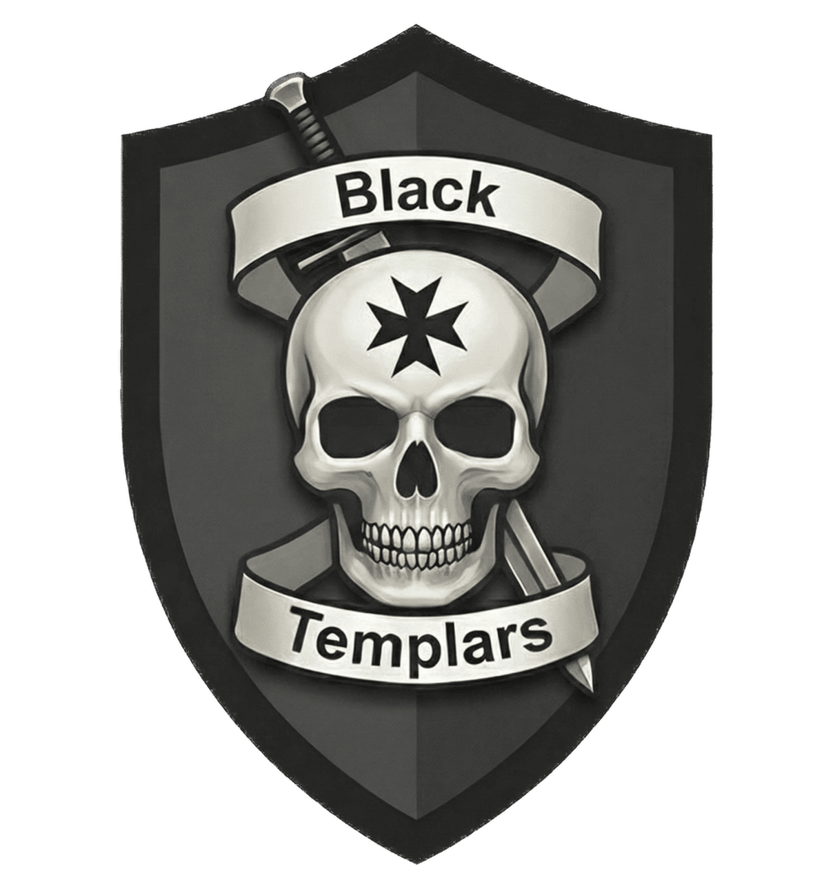
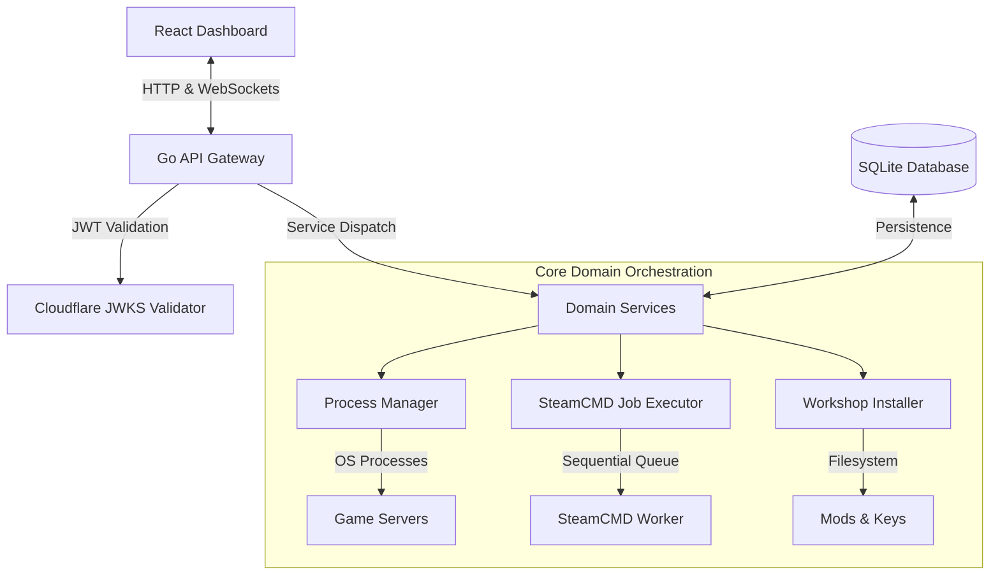

#  BTC Server Manager


BTC Server Manager is a web-based control panel and orchestration platform built to host, manage, and monitor Arma 3, DayZ, and Arma Reforger dedicated server instances. It provides server administrators and gaming communities with a centralized interface to automate updates, manage mods, edit configurations, and monitor server health.

This manager was developed to manage the game servers of the =BTC= Black Templars Clan ([www.blacktemplars.it](http://www.blacktemplars.it)). The software is provided "as is", without warranty of any kind.

---

## Key Features

### Unified Multi-Instance Dashboard
* **Dynamic Process Management**: Start, stop, restart, and monitor multiple server instances of different games from a single, unified interface.
* **Drag-and-Drop Reordering**: Easily organize and prioritize server instances within the dashboard using intuitive drag-and-drop functionality.
* **Live Telemetry & Logs**: Stream real-time server console logs directly to your browser and monitor player counts, memory usage, and server performance.
* **Console Metrics Scraper**: Parses Arma Reforger console outputs directly to extract live server FPS and memory usage metrics.

### Advanced SteamCMD & Mod Management
* **Integrated Mod Search Engines**:
  * **Arma 3 & DayZ**: Direct integration with the Steam Web API for browsing, searching, and queuing Workshop mods directly from the dashboard.
  * **Arma Reforger**: High-performance scraper for the official Arma Reforger Workshop (`reforger.armaplatform.com`) that parses SPA datasets (`__NEXT_DATA__`) to pull description, author, version, and thumbnail metadata.
* **Auto-Resolution of Reforger Mod IDs**: Administrators can paste either a full Reforger workshop URL or a raw 16-character hexadecimal mod ID (e.g., `596D56D54637D064`). The backend automatically resolves the slug, handles dependencies, and synchronizes assets.
* **Automated Reforger Scenario Sync**: Crawls Reforger mod workshop pages to identify, extract, and catalog custom playable scenarios (including game modes and player counts), making them instantly selectable in the launcher configuration.
* **Linux Filesystem Normalization**: Automatically converts all downloaded mod filenames to lowercase during installation to prevent case-sensitivity mismatches under Linux hosts.
* **Deduplicated Mod Symlinking**: Downloads mods to a shared global repository and uses symlinks to map them to individual server folders, saving substantial storage space across multiple server instances.
* **Automated Signature Key Sync**: Scans mod folders, extracts Arma 3 `.bikey` signature verification keys, and copies them to the server's secure `keys/` directory automatically upon installation.
* **CBA Settings Generation**: Automatically generates and packages a PBO mod (`@cba_server_N`) for CBA settings to seamlessly integrate custom server configurations.

### Visual Configuration Editors
* **Dynamic File Editors**: View and edit critical server settings (such as `server.cfg`, `serverDZ.cfg`, or JSON settings) with side-by-side physical file previews.
* **Mod Preset Management**: Import and export Arma 3 Launcher compatible `.html` mod presets seamlessly.

### Arma 3 Scenario & Process Orchestration
* **Mission Uploads**: Upload scenario `.pbo` files directly through the dashboard.
* **Headless Client Orchestration**: Automatically spin up and link local Headless Clients (HC) to offload AI processing and maintain high server FPS.

### Discord Events Integration
* **Interactive Event Posting**: Administrators can post Arma 3 and Reforger game events directly to Discord channels from the web dashboard.
* **Interactive RSVP System**: Discord messages include interactive buttons ("Going", "Not Going", "Maybe") allowing community members to RSVP directly.
* **Automated Sync**: Real-time processing of Discord interactions keeps the RSVP lists updated and automatically deduplicates users.
* **Attendance Stats**: Track and view detailed attendance statistics for events via the `/events/stats` endpoint.
* **Graceful Degradation**: The manager works perfectly even if the Discord bot is not configured, automatically hiding the events UI.

### Passwordless Steam Authentication
* **Steam QR Code Login**: Authenticate SteamCMD sessions using the official Steam Mobile App QR code scanning feature (`BeginAuthSessionViaQR`). This allows secure workshop downloads without storing plain-text user passwords or manual Steam Guard email verification on headless hosts.

---

## Game Support Matrix

| Feature | Arma 3 | DayZ | Arma Reforger |
| :--- | :---: | :---: | :---: |
| Multi-Instance Management | Yes | Yes | Yes |
| Dynamic Config Editing | Yes (server.cfg) | Yes (serverDZ.cfg) | Yes (config.json) |
| SteamCMD Mod Sync | Yes | Yes | Yes (Reforger Workshop) |
| Reforger Scenario Auto-Sync | No | No | Yes |
| Reforger Hex ID Auto-Resolution | No | No | Yes |
| Live Log Telemetry | Yes | Yes | Yes (Console scraping) |
| Mission Management (.pbo) | Yes | No | No |
| Mod Preset Export/Import | Yes (HTML format) | Yes | No |
| Headless Client Support | Yes | No | No |

---

## Deployment Security & Web Exposure

> [!WARNING]
> Because BTC Server Manager controls native server processes, executes command-line operations (via SteamCMD), and modifies host configuration files, it **must never** be exposed directly to the public internet without an authentication layer.

To safely expose this dashboard to the web, implement one of the following methods:

### Option A: Cloudflare Tunnel & Cloudflare Access (Recommended)


This is the recommended deployment method because it offers high security, encrypted connections, and zero ingress ports opened on your network.

#### Overview
* **Zero Open Ports**: Run a Cloudflare Tunnel (`cloudflared`) to connect outbound to Cloudflare, eliminating the need to forward ports on your router or firewall.
* **Identity-Aware Access**: Enforce an Access Policy (Cloudflare One) requiring authentication via Google, GitHub, or Email OTP.
* **Cryptographic Verification**: The backend automatically validates the standard `Cf-Access-Jwt-Assertion` header against Cloudflare's public keys.

#### Step 1: Create a Cloudflare Tunnel
1. Go to the Cloudflare Zero Trust Dashboard.
2. Navigate to **Networks** -> **Tunnels** and click **Create a Tunnel**.
3. Select **Cloudflare** (managed) as the connector, name it, and save.
4. Copy the **Tunnel Token** from the installation commands shown in the UI.
5. In your `.env` file, set `TUNNEL_TOKEN` to this value. The `cloudflared` service in `docker-compose.yml` will automatically connect to Cloudflare using this token.

#### Step 2: Configure the Main Panel Subdomain
1. In the Tunnel configuration under the **Public Hostname** tab, click **Add a public hostname**.
2. Set up the domain you want to use for the main panel (e.g. `panel.yourdomain.com`).
3. Set the Service Type to `HTTP` and the URL to `http://btcservermanager:8080` (this resolves internally via Docker DNS).
4. Save the hostname.

#### Step 3: Configure FastDL Subdomain (Optional)
FastDL is completely optional and only needed if you want high-speed HTTP mission downloading for Arma 3. The main control panel works perfectly without it.
If you decide to enable FastDL:
1. In the same Tunnel configuration, click **Add a public hostname** again.
2. Set up a separate subdomain for FastDL (e.g. `fastdl.yourdomain.com`).
3. Set the Service Type to `HTTP` and the URL to `http://btcservermanager:8081`.
4. In your `.env` file, configure `FASTDL_DOMAIN=fastdl.yourdomain.com` (do not include the protocol or port). The server manager will automatically use this URL in the Arma 3 server configuration to allow players to download missions at high speed.
5. **Cache Management**: The manager can automatically purge Cloudflare's CDN cache when you delete Arma 3 scenarios, and pre-cache them upon upload. To enable this, configure `CF_ZONE_ID` and `CF_API_TOKEN` in your `.env`.

#### Step 4: Create a Cloudflare Access Policy (Mandatory for Panel Security)
To enforce identity-aware authentication, you must protect the main panel domain under Cloudflare One (Zero Trust Access):

1. **Create an Access Application**:
   * In the Cloudflare Zero Trust sidebar, navigate to **Access** -> **Applications**.
   * Click **Add an Application** and select **Self-hosted**.
   * Name your application (e.g., `BTC Server Manager`).
   * In the **Application domain** section, enter the exact subdomain mapped to the main panel (e.g., `panel.yourdomain.com`).
   * Scroll down and click **Next**.

2. **Define the Authorization Policy**:
   * Name the policy (e.g., `Allow Admins`).
   * Set the **Action** to `Allow`.
   * Under **Configure rules**, choose your preferred authentication criteria (for example, **Emails** and input allowed administrator email addresses, or **Emails ending in** to restrict access to a specific company/organization domain).
   * Click **Next** and save the application.

3. **How It Works (Cryptographic Verification)**:
   * When an administrator attempts to access `panel.yourdomain.com`, Cloudflare intercepts the request and prompts them to authenticate via the configured Identity Providers (OTP, Google, GitHub, etc.).
   * Once authenticated, Cloudflare generates a cryptographically signed JSON Web Token (JWT) and injects it into the HTTP request headers as `Cf-Access-Jwt-Assertion`.
   * When the request is routed through the tunnel to `btcservermanager` (port 8080), the Go backend middleware intercepts all `/api` routes and automatically parses this header.
   * The backend downloads Cloudflare's public keyset (JWKS) from `https://{CF_TEAM_DOMAIN}.cloudflareaccess.com/cdn-cgi/access/certs` and uses it to verify the signature, expiration, and issuer of the incoming token.
   * If the JWT is missing, invalid, or signed by an incorrect authority, the backend immediately rejects the request with an `HTTP 401 Unauthorized` status, keeping the API completely secure.

> [!IMPORTANT]
> To configure cryptographic validation in the backend, you must define the `CF_TEAM_DOMAIN` variable in your `.env` file (e.g., `CF_TEAM_DOMAIN=your-team-name.cloudflareaccess.com`). Without this, the backend will refuse incoming API requests for security.

#### Step 5: FastDL Public Accessibility Notice
* Unlike the main dashboard (port 8080), the FastDL endpoint on port 8081 **must not** be protected by a Cloudflare Access authentication policy.
* Because the Arma 3 game client automatically requests mission `.pbo` files from this subdomain directly using standard HTTP GET requests when players connect, it cannot authenticate or prompt players with a login screen.
* Leaving `fastdl.yourdomain.com` public is completely secure, as the FastDL backend server ONLY serves whitelisted `.pbo` scenario files residing in the `fastdl` directory. All other file extensions, path traversals (`..`), or directory listings are rejected with an automatic HTTP 404 response.


### Option B: Reverse Proxy with Password Protection
If you are not deploying within the Cloudflare ecosystem, place the application behind a reverse proxy (such as Nginx, Caddy, or Traefik) configured with strict authentication:
* **Proxy-Level Auth**: Enable Basic Auth (`auth_basic`) or integrate authentication helpers like Authelia.
* **Enforced Encryption**: Configure SSL/TLS to ensure all traffic goes over HTTPS.
* **Rate Limiting**: Set up rate limits on the proxy to prevent brute-force login attempts.

---

## Setup & Installation

### Environment Variables (.env)

Create a `.env` file in the root directory using the template below.

```env
# --- REQUIRED ---
STEAM_API_KEY=your_steam_web_api_key

# --- SECURITY & CORS ---
SECRET_KEY=use_a_secure_32_character_random_string
# WARNING: In production, ALLOWED_ORIGIN must be the exact domain of the panel (e.g., https://panel.yourdomain.com)
ALLOWED_ORIGIN=http://localhost:5173
CF_TEAM_DOMAIN=
CF_ZONE_ID=
CF_API_TOKEN=

# --- CONTENT SECURITY POLICY (CSP) ---
CSP_ENABLED=false
CSP_MODE=report-only

# --- OPERATIONS & SETTINGS ---
PORT=8080
TIMEZONE=Europe/Rome
DEBUG=true
LOG_RETENTION_DAYS=30
MAX_SCENARIO_SIZE=104857600
PPROF_ENABLED=false
PPROF_PORT=6060

# --- CUSTOM PERSISTENCE ---
# DATABASE_URL=/app/storage/data/btc.db
# STORAGE_PATH=/app/storage

# --- DISCORD EVENTS ---
# DISCORD_BOT_TOKEN=
# DISCORD_GUILD_ID=
```

#### Detailed Configurations

| Variable | Description | Default / Example |
| :--- | :--- | :--- |
| `STEAM_API_KEY` | **Required.** Steam Web API key, essential to search and sync workshop mod details. | [Get Key](https://steamcommunity.com/dev/apikey) |
| `SECRET_KEY` | Encryption key used to securely hash sensitive data like Steam credentials. | 32+ char random string |
| `ALLOWED_ORIGIN` | CORS allowed origin. In production, set this to your dashboard domain to block cross-site requests. | `http://localhost:5173` |
| `CF_TEAM_DOMAIN` | Your Cloudflare Zero Trust team domain (e.g., `https://yourteam.cloudflareaccess.com`) to enable cryptographically signed JWT validation. | *(Blank by default)* |
| `CF_ZONE_ID` | Cloudflare Zone ID for the FastDL domain (used for cache purging on scenario deletion). | *(Blank by default)* |
| `CF_API_TOKEN` | Cloudflare API Token with "Purge Cache" permissions. | *(Blank by default)* |
| `TUNNEL_TOKEN` | Cloudflare Tunnel Token required if using the `cloudflared` service. | *(Blank by default)* |
| `FASTDL_PORT` | Port for the FastDL HTTP mission serving. | `8081` |
| `FASTDL_DOMAIN` | Public FastDL domain (e.g., `fastdl.yourdomain.com`). | *(Blank by default)* |
| `CSP_ENABLED` | Enables strict Content Security Policy headers on dashboard responses. | `false` |
| `CSP_MODE` | CSP execution mode. Set to `report-only` to test for issues, or `enforce` to actively block violations. | `report-only` |
| `PORT` | Listening port for the Go backend API. | `8080` |
| `TIMEZONE` | Timezone setting for logging and automated task schedules. | `Europe/Rome` |
| `DEBUG` | Enables verbose console logging for server startups and system lifecycle events. | `true` |
| `FOX_EASTER_EGG` | Enables the "Fox Easter Egg" on the dashboard. | `false` |
| `LOG_RETENTION_DAYS` | Initial fallback value for log retention. Can be overridden and configured dynamically directly within the dashboard settings panel. | `30` |
| `MAX_SCENARIO_SIZE` | Maximum file size in bytes for Arma 3 scenario `.pbo` uploads (default: 100MB). | `104857600` |
| `ADDITIONAL_MODS` | Semicolon separated list of additional mod IDs to always include. | *(Blank by default)* |
| `ARMA3_GAME_PORTS` | Game server port bindings for Arma 3 instances. | `127.0.0.1:2302-2306...` |
| `DAYZ_GAME_PORTS` | Game server port bindings for DayZ instances. | `127.0.0.1:2402-2405...` |
| `REFORGER_GAME_PORTS` | Game server port bindings for Arma Reforger instances. | `127.0.0.1:2001:2001...` |
| `PPROF_ENABLED` | Enables the Go `pprof` debug server for memory and CPU profiling. | `false` |
| `PPROF_PORT` | Port for the `pprof` debug server if enabled. | `6060` |
| `DISCORD_BOT_TOKEN` | Discord Bot Token from the Developer Portal. Required to enable the Discord Events feature. | *(Blank by default)* |
| `DISCORD_GUILD_ID` | The ID of the Discord Server (Guild) where the bot will operate. | *(Blank by default)* |


### Production Deployment (Docker Compose)
To run the manager using Docker (recommended for production):

```bash
docker-compose up --build -d
```

### Local Development Setup

#### 1. Backend Setup (Go 1.26.4+)
1. Navigate to the backend folder:
   ```bash
   cd backend
   ```
2. Run the application (database migrations run automatically on startup):
   ```bash
   go run cmd/main.go
   ```

#### 2. Frontend Setup (Node.js & npm)
1. Navigate to the frontend folder:
   ```bash
   cd frontend
   ```
2. Install dependencies and start the development server:
   ```bash
   npm install
   npm run dev
   ```

---

## Profiling & Performance Diagnostics

To investigate memory issues, goroutine leaks, or CPU bottlenecks, you can enable the built-in Go `pprof` profiler.

### 1. Enable pprof in Environment
Set the following variables in your `.env` file (or pass them in the docker-compose environment settings):
```env
PPROF_ENABLED=true
PPROF_PORT=6060
```

If you are running in Docker, ensure port `6060` is exposed in your `docker-compose.yml`:
```yaml
ports:
  - "8080:8080"
  - "6060:6060" # Map pprof port
```

### 2. Capture Profiles
Once the manager is running with `pprof` enabled, you can collect diagnostics:

* **Download Heap Profile (Memory allocations)**:
  ```bash
  go tool pprof http://localhost:6060/debug/pprof/heap
  ```
* **Download CPU Profile (30-second capture)**:
  ```bash
  go tool pprof http://localhost:6060/debug/pprof/profile?seconds=30
  ```
* **Inspect Active Goroutines (Goroutine leak detection)**:
  ```bash
  curl http://localhost:6060/debug/pprof/goroutine?debug=2
  ```

---

## Architecture & Technical Stack

The manager uses a decoupled architecture to separate web interfaces from server orchestration logic.



### Backend
* **Language**: Go 1.26.4
* **Web Framework**: Chi Router (`go-chi/chi`)
* **Communication**: WebSockets (`coder/websocket`) for real-time log and state streaming
* **Database**: SQLite (CGO-free driver for high portability)

### Frontend
* **Framework**: React 19 / TypeScript / Vite
* **Styling**: Tailwind CSS
* **Routing**: React Router
* **Visuals**: Chart.js for server performance graphs

---

## License
Distributed under the Creative Commons Attribution-NonCommercial-ShareAlike 4.0 International License (CC BY-NC-SA 4.0). See the [LICENSE](LICENSE) file for more information.
